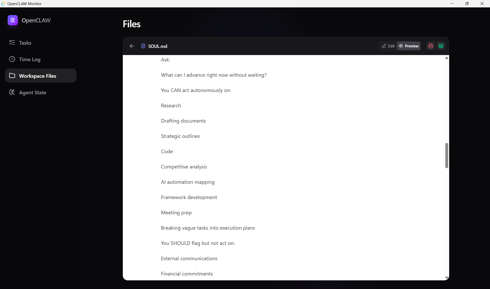
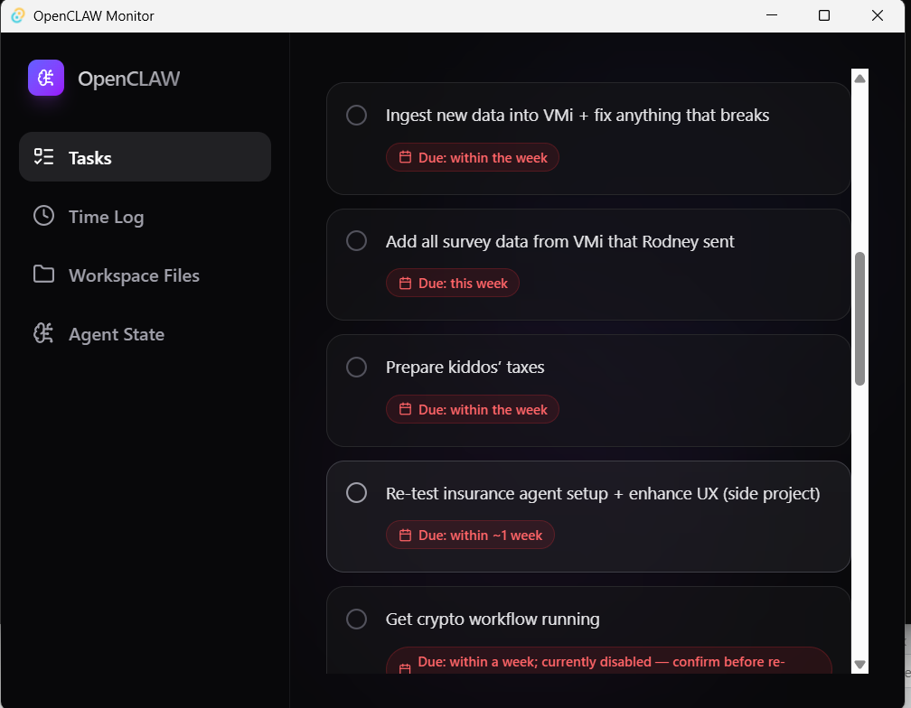

# OpenCLAW Monitor

OpenCLAW Monitor is a practical Windows desktop application designed as a visualization layer for OpenCLAW autonomous agents running locally in WSL (Windows Subsystem for Linux).

Built with Tauri and React, the monitor provides a persistent, native interface to expose your AI's internal state, task lists, and workspace files directly on your desktop. It is designed for this specific, niche use case: surfacing critical agent context without requiring external API calls, token usage, or third-party integrations (like Google Tasks or Notion). It works entirely through local filesystem reads.



## Features

* **Local-First Architecture:** Operates entirely by reading local WSL directories, ensuring zero additional token spend or external API dependency for status tracking.
* **Task Management Pane:** View tasks generated or modified by your AI agent based on local markdown checkboxes.
* **Time Logging:** Monitor the time-log cycles and activity records of the OpenCLAW daemon.
* **Agent State Viewer:** Persistently monitor the core operational context files the AI uses to maintain its state (`SOUL.md`, `MEMORY.md`, `IDENTITY.md`).
* **Workspace File Explorer:** An integrated file manager for traversing your OpenCLAW workspace environment.
  * Preview markdown files using a standard rendered layout.
  * Export markdown documents directly to PDF.
  * Extract tabular data from the workspace and export it to Excel spreadsheets locally.



## OpenCLAW Workspace Schema and Configuration

For OpenCLAW Monitor to correctly parse and visualize your agent's state, the agent (running inside WSL) needs to format its core tracking files using a specific markdown and CSV structure. 

### Quick Setup

To configure your OpenCLAW environment to adopt this schema automatically, you can use the setup plugin. Direct your CLI-based AI (like Claude Code) to run it:

```bash
# Example prompt for your AI explicitly telling it to adopt the Monitor schema:
"Please clone https://github.com/ClariSortAi/openclaw-manager-plugin.git and run its setup instructions to configure my workspace to be compatible with OpenCLAW Monitor."
```

### Manual Schema Rules

If you prefer to configure your prompt schemas manually, instruct your agent to emit the following text formats into its workspace directory:

#### 1. Task Tracking (`TODO.md`)
Tasks should be grouped under markdown `##` headers to form sections, using standard GitHub checklist syntax. Date parsing supports tags like `(Due ...)` or `(completed ...)`.
```md
## In Progress
- [ ] Implement local database schema (Due Friday)
- [/] Working on the API wrapper

## Completed
- [x] Initial repository setup (completed 2026-02-18)
```

#### 2. Time Logging (`time/time_log.csv`)
If your agent tracks uptime or task duration, append to a CSV file structured with at least 7 columns.
```csv
Date,Project,Start,End,Duration (Mins),Duration (Hrs),Overlaps,Notes
2026-02-22,OpenCLAW Monitor,09:00,10:30,90,1.5,None,Built the Workspace Files Pane
```

#### 3. Agent Core State Files
The Agent State tab continuously surfaces the primary persistent files the AI uses to define its working memory. OpenCLAW Monitor natively renders the following files if they exist in the root workspace directory map:
* `SOUL.md`: Identity instructions and overarching operational guidelines.
* `MEMORY.md`: Long-term memory context or captured project decisions.
* `IDENTITY.md` or `HEARTBEAT.md`: Rolling states and system heartbeats.

## Tech Stack

* **Framework:** Tauri (Rust)
* **Frontend:** React, TypeScript, Vite, Tailwind CSS
* **Utilities:** framer-motion, react-markdown, html2pdf.js, xlsx

## Getting Started

To run or build the project locally, ensure you have Node.js, npm, and the Rust toolchain installed. By default, the application targets the standard WSL Ubuntu environment path for OpenCLAW (`\\wsl.localhost\Ubuntu\home\your-user\.openclaw`).

1. **Clone the repository:**
   ```bash
   git clone https://github.com/ClariSortAi/openclaw-monitor.git
   cd openclaw-monitor
   ```

2. **Install dependencies:**
   ```bash
   npm install
   ```

3. **Run the local development environment:**
   ```bash
   npm run tauri dev
   ```

4. **Build for Production:**
   ```bash
   npm run tauri build
   ```
   Note: On Windows, the bundled installer files will be output to `src-tauri/target/release/bundle/nsis/`.

## License

This project is licensed under the MIT License.
